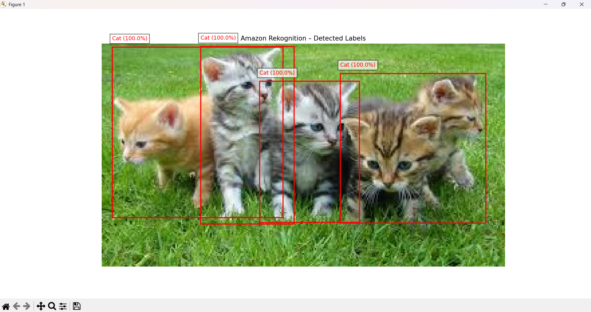
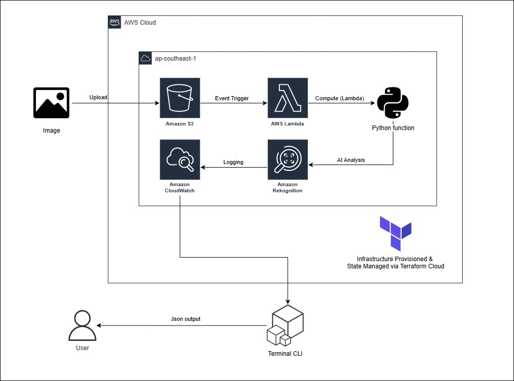

  <h1>📷 AWS Image Labels Generator</h1>
    
    

        The <strong>AWS Image Labels Generator</strong> is a cloud-native automated solution designed to detect and catalog objects, scenes, and concepts within images. By leveraging advanced machine learning, this project allows users to upload images to a secure cloud storage environment and receive detailed metadata labels with high confidence scores. 
         
      <a href="#about-the-project"><strong>Explore the docs »</strong></a>
    

  
Table of Contents

  <ol>
    <li><a href="#about-the-project">About The Project</a></li>
    <li><a href="#built-with">Built With</a></li>
    <li><a href="#use-cases">Use Cases</a></li>
    <li><a href="#architecture">Architecture</a></li>
    <li><a href="#getting-started">Getting Started</a></li>
    <li><a href="#usage">Usage</a></li>
    <li><a href="#roadmap">Roadmap</a></li>
    <li><a href="#cost-optimization">Cost Optimization</a></li>
    <li><a href="#contact">Contact</a></li>
  </ol>

<h2 id="about-the-project">About The Project</h2>

    This project was built to demonstrate a modern <strong>GitOps workflow</strong> and <strong>Infrastructure as Code (IaC)</strong> principles using Terraform Cloud. It provides a bridge between raw image data and actionable insights, suitable for applications ranging from automated media tagging to brand coverage analysis.

<a href="#readme-top">↑ Back to Top</a>

<h2 id="built-with">Built With</h2>

  
  
  
  
  

<ul>
  <li><strong>Terraform:</strong> Used for Infrastructure as Code to provision and manage AWS resources.</li>
  <li><strong>Terraform Cloud:</strong> Manages the VCS-driven workflow and state for the infrastructure.</li>
  <li><strong>AWS S3:</strong> Provides highly durable and scalable object storage for the source images.</li>
  <li><strong>Amazon Rekognition:</strong> A deep-learning-based service that performs the heavy lifting of image analysis and label detection.</li>
  <li><strong>AWS IAM:</strong> Ensures secure, least-privilege access for the application code to interact with AWS services.</li>
  <li><strong>Python (Boto3):</strong> The programming language and SDK used to execute the label detection logic.</li>
</ul>

<a href="#readme-top">↑ Back to Top</a>

<h2 id="use-cases">Use Cases</h2>

    Amazon Rekognition is a highly versatile service with applications across many industries. This project can be adapted for the following real-world scenarios:

<ul>
    <li><strong>Smart Surveillance Systems:</strong> Automatically recognize suspicious objects or activities on roads to enhance public safety.</li>
    <li><strong>Inventory Management:</strong> Identify and catalog products in a store environment to streamline supply chain operations.</li>
    <li><strong>Retail Analytics:</strong> Analyze customer behavior within physical stores to optimize layouts and marketing strategies.</li>
    <li><strong>Accessibility Solutions:</strong> Provide automated descriptions of surroundings to assist individuals who are visually impaired.</li>
</ul>

<a href="#readme-top">↑ Back to Top</a>

<h2 id="architecture">Architecture</h2>

  

  The system follows a serverless-inspired architecture to ensure scalability and cost-efficiency:

<ol>
  <li><strong>Storage Layer:</strong> Images are uploaded to a private Amazon S3 bucket. Access is strictly controlled via a Public Access Block.</li>
  <li><strong>Processing Layer:</strong> A Python script using the <code>boto3</code> library triggers the <code>DetectLabels</code> API on the Amazon Rekognition service.</li>
  <li><strong>Identity Layer:</strong> A dedicated IAM user and policy provide the script with specific permissions to read from the S3 bucket and call the Rekognition service.</li>
  <li><strong>Output Layer:</strong> The script processes the JSON response from Rekognition, displaying detected labels along with their confidence percentages.</li>
</ol>

<a href="#readme-top">↑ Back to Top</a>

<h2 id="getting-started">Getting Started</h2>
<h3>Prerequisites</h3>
<ul>
    <li>An active <strong>AWS Account</strong>.</li>
    <li><strong>Terraform CLI / Terraform Cloud(optional)</strong> for IaC deployment.</li>
    <li><strong>Python 3.x</strong> installed locally for running the detection script.</li>
</ul>

<h3>Installation & Deployment</h3>
<ol>
    <li>
        <strong>Clone the Repository:</strong>
    </li>
    <li>
        <strong>Provision Infrastructure:</strong>
        Push your changes to the <code>main</code> branch to trigger a Terraform Cloud plan. Once approved, Terraform will provision your S3 bucket and IAM resources.
    </li>
    <li>
        <strong>Configure Local Environment:</strong>
        Create a <code>.env</code> file or export your AWS credentials and the S3 bucket name (found in the Terraform output) to your environment variables.
    </li>
    <li>
        <strong>Install Python Dependencies:</strong>
        <code>pip install -r requirements.txt</code>
    </li>
</ol>

<a href="#readme-top">↑ Back to Top</a>

<h2 id="usage">Usage & Testing</h2>

  To generate labels for an image, follow these steps:

<ol>
  <li>
    Upload an image (e.g., <code>busy-traffic-road.jpg</code>) to the S3 bucket created by Terraform. 
    <pre>aws s3 cp &lt;your-image-file-name&gt; s3://&lt;your-s3-bucket-name&gt;</pre>
    
  </li>
  <li>Update the <code>IMAGE_NAME</code> variable in <code>detect_labels.py</code> to match your file name.</li>
  <li>Run the script: <code>python detect_labels.py</code>.</li>
  <li>The script will output a list of detected objects (e.g., "Car: 99.2%", "Pedestrian: 88.5%") and display the image with bounding boxes if available.</li>
</ol>
<h3>
  Browser Output
</h3>
  

<h3>
  CLI Output
</h3>

<a href="#readme-top">↑ Back to Top</a>

<h2 id="roadmap">Project Roadmap</h2>
<ul>
  <li>[x] <strong>Storage Setup:</strong> Create a private Amazon S3 bucket to act as the central repository for your source images.</li>
  <li>[x] <strong>Environment Config:</strong> Install and configure the AWS CLI and Python environment (boto3, Pillow) to communicate with cloud services.</li>
  <li>[x] <strong>Logic Development:</strong> Develop the Python script using the detect_labels function to send images to Amazon Rekognition.</li>
  <li>[x] <strong>Execution & Verification:</strong> Run the script to generate metadata tags and verify object detection results with bounding boxes.</li>
</ul>

<a href="#readme-top">↑ Back to Top</a>

<h2 id="cost-optimization">Cost Optimization (Free Tier)</h2>

  To keep the project budget-friendly, the following strategies are implemented or recommended:

<ul>
  <li><strong>S3 Lifecycle Policies:</strong> Automatically transition images to <em>S3 Standard-IA</em> or <em>Glacier</em> after 30 days of inactivity to reduce storage costs.</li>
  <li><strong>Confidence Thresholds:</strong> By setting a <code>MIN_CONFIDENCE</code> level (e.g., 70%), we filter out low-certainty results, reducing unnecessary data processing.</li>
  <li><strong>Free Tier Utilization:</strong> Amazon Rekognition and S3 both offer free tier limits for the first 12 months, which this project stays within for light usage.</li>
  <li><strong>Manual Apply in TFC:</strong> Set Terraform Cloud to "Manual Apply" to prevent accidental resource creation and associated costs.</li>
</ul>

<a href="#readme-top">↑ Back to Top</a>

<h2 id="contact">Contact</h2>

Tan Si Kai - <a href="https://linkedin.com/in/si-kai-tan">LinkedIn</a>

Project Link: <a href="https://github.com/ShenLoong99/my-terraform-aws-projects-2025/tree/main/AWS-Image-Labels-Generator">Image Labels Generator</a>

<a href="#readme-top">↑ Back to Top</a>
